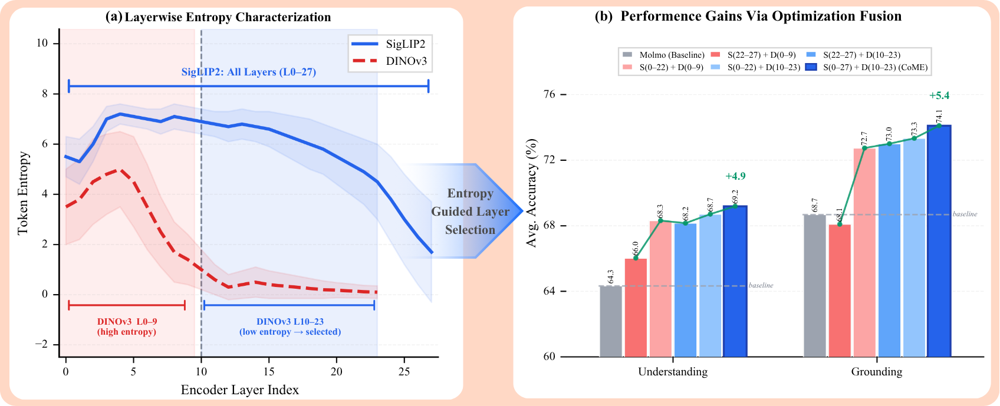
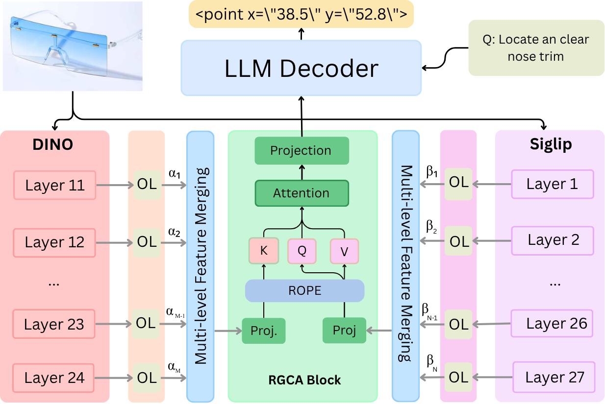

<div align="center">
  <h1>CoME-VL: Scaling Complementary Multi-Encoder Vision-Language Learning</h1>
</div>
<p align="center">
  <a href="https://github.com/mbzuai-oryx/CoME-VL">
    
  </a>
  <a href="https://arxiv.org/abs/2604.03231">
    
  </a>
  <a href="https://mbzuai-oryx.github.io/CoME-VL/">
    
  </a>
  <a href="https://huggingface.co/MBZUAI/CoME-VL">
    
  </a>
</p>
<div align="center">
  
</div>
---

## Overview

**CoME-VL** is a complementary multi-encoder vision-language framework that fuses contrastively trained and self-supervised visual representations to improve both visual understanding and grounding. Built on top of [Molmo](https://github.com/allenai/molmo) (Ai2), CoME-VL introduces three key architectural innovations:

- **Entropy-guided layer selection** to identify and select complementary layer ranges from SigLIP2 and DINOv3
- **Orthogonality-regularized multi-layer mixing (OL)** to reduce redundancy and promote complementary feature fusion
- **RoPE-enhanced cross-attention (RGCA)** to spatially align heterogeneous token grids across encoders

<div align="center">
  
  <p>Overview of CoME-VL: dual encoders (SigLIP2 + DINOv3) fused via orthogonality-regularized mixing and RoPE-based cross-attention, injected into a decoder-only LLM.</p>
</div>

---

## Installation

Python 3.10 is recommended. First install [PyTorch](https://pytorch.org) for your platform, then:

```bash
git clone https://github.com/ankan8145/COME-VL.git
cd COME-VL
pip install -e .[all]
```

---

## Environment Setup

```bash
export MOLMO_DATA_DIR=/path/to/data
export HF_HOME=/path/to/huggingface/cache
```

---

## Training

Fine-tune starting from a pretrained checkpoint:

```bash
HF_HUB_OFFLINE=1 \
TRANSFORMERS_OFFLINE=1 \
WANDB_MODE=offline \
WANDB_API_KEY="<your_wandb_key>" \
WANDB_PROJECT="come-vl" \
WANDB_ENTITY="<your_entity>" \
CUDA_VISIBLE_DEVICES=0,1,2,3,4,5,6,7 \
torchrun --standalone --nnodes=1 --nproc_per_node=8 \
  launch_scripts/train_multitask_model.py \
  3.2-synthetic \
  checkpoint_folder \
  --save_folder=output_folder \
  --save_overwrite
```

**Notes:**
- `checkpoint_folder` should point to your starting model checkpoint directory.
- `--save_folder` should use a short, descriptive name — avoid long paths with special characters.
- `3.2-synthetic` specifies the training data mixture.
- `--save_overwrite` allows overwriting an existing save folder.

---

## Evaluation

```bash
torchrun --nproc-per-node 1 --master_port 29504 \
  launch_scripts/eval_downstream.py \
  checkpoint_folder \
  "test-low-res" \
  --save_to_checkpoint_dir
```

**Notes:**
- `test-low-res` evaluates at standard resolution on the test split.
- Use `test-high-res` for high-resolution evaluation (add `--fsdp --high_res` flags).
- Results and predictions are saved into the checkpoint directory.
- Add `--overwrite` to re-run and replace cached metrics.

---

## Model Architecture

CoME-VL uses:

- **Language backbone:** Qwen2-7B
- **Contrastive encoder:** SigLIP2-SO400M — semantic alignment
- **Self-supervised encoder:** DINOv3-Large — spatial grounding
- **Selected layers:** SigLIP2 layers 0–27 (all) + DINOv3 layers 10–23 (entropy-guided)

---

## Data

Most data is managed via HuggingFace Datasets. Training uses the [PixMo dataset](https://huggingface.co/collections/allenai/pixmo-674746ea613028006285687b) and RefCOCO.

Download all datasets:

```bash
python3 scripts/download.py all --n_proc 12
```

Download a specific dataset:

```bash
python3 scripts/download_data.py pixmo_count_counting --n_proc 12
```

---

## Pretrained Model Initialization

Convert HuggingFace weights before training from scratch:

```bash
python3 scripts/convert_hf_to_molmo.py qwen2_7b
python3 scripts/convert_hf_to_molmo.py openai
```

---
---

## Citation

If you find CoME-VL useful in your research, please consider citing:
```bibtex
@article{comevl2026,
  title={CoME-VL: Scaling Complementary Multi-Encoder Vision-Language Learning},
  author={Deria, Ankan and Kumar, Komal and He, Xilin and Razzak, Imran and Cholakkal, Hisham and Khan, Fahad Shahbaz and Khan, Salman},
  journal={arXiv preprint},
  year={2026}
}
```
---
## Star History Chart
[](https://www.star-history.com/#mbzuai-oryx/CoME-VL&type=date&legend=top-left)

## Acknowledgements

This codebase is built on top of **[Molmo](https://github.com/allenai/molmo)** by the Allen Institute for AI (Ai2). We thank the Ai2 team for open-sourcing their work.
